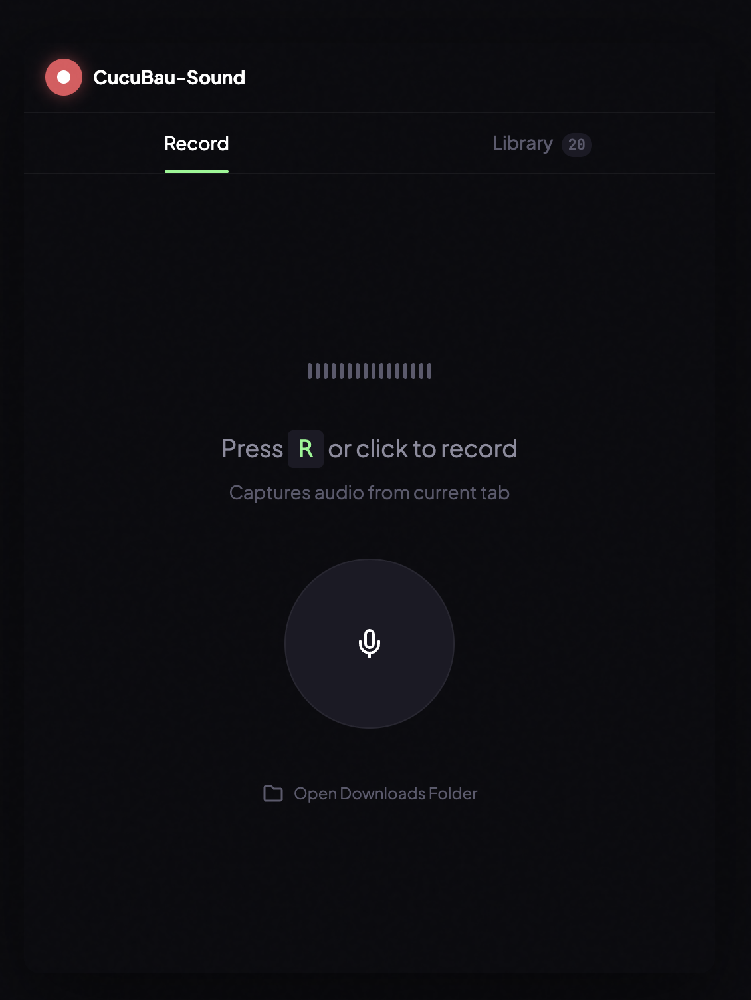
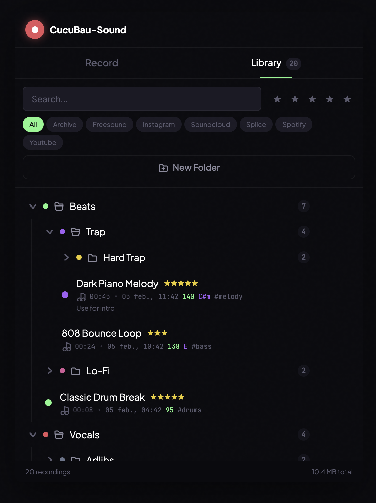
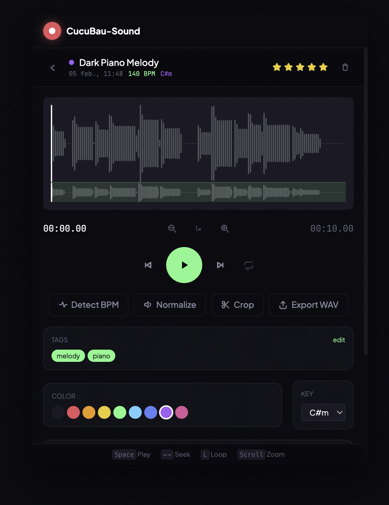
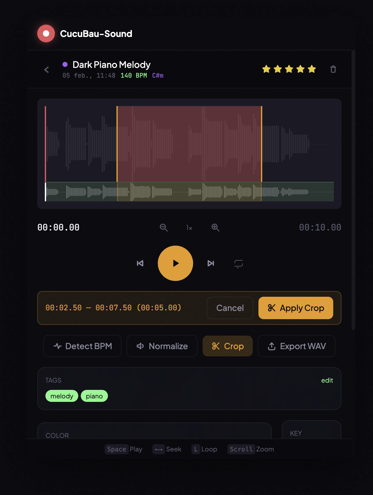

# CucuBau-Sound

A free Chrome extension for capturing audio from any browser tab. Built for music producers, beatmakers, and sample collectors who want to quickly grab sounds from YouTube, SoundCloud, Spotify, or any website and organize them into a personal sound library.

No servers. No analytics. No tracking. No accounts. Everything runs locally in your browser. Made with love for music.

---

## Features

### Recording
- **One-click tab audio capture** — Press `R` or click the mic button to start recording the current tab's audio
- **Live timer** — See elapsed recording time with animated waveform indicator
- **Automatic metadata** — Saves the tab title, website hostname, date, and file size with each recording

### Library & Organization
- **Folder tree** — Create nested folders to organize your samples (e.g., Beats > Trap > Hard Trap)
- **Drag & drop** — Move recordings between folders, reorder recordings within folders, drag folders into other folders or reorder them
- **Color-coded folders** — Assign colors to folders for quick visual identification
- **Search** — Filter recordings by name across your entire library
- **Filter by site** — Quick-filter chips for YouTube, SoundCloud, Splice, Instagram, etc.
- **Star ratings** — Rate recordings 1-5 stars and filter by minimum rating
- **Smart empty-folder hiding** — Folders with no matching recordings auto-hide when filters are active

### Audio Player
- **Waveform display** — Full waveform visualization powered by WaveSurfer.js
- **Minimap** — Overview minimap below the main waveform for quick navigation
- **Zoom & pan** — Scroll to zoom in/out, drag to pan across the waveform
- **Loop playback** — Toggle loop mode for any recording
- **Keyboard shortcuts** — `Space` play/pause, `Arrow keys` seek, `L` loop, `Scroll` zoom
- **BPM detection** — Auto-detect the tempo of any recording
- **Volume normalization** — Normalize audio levels with one click
- **Export WAV** — Export any recording as a WAV file with automatic file reveal in Finder/Explorer

### Crop Mode
- **Visual crop region** — Drag handles to select the portion you want to keep
- **Precise trimming** — See exact start time, end time, and duration of your selection
- **Loop preview** — Preview your crop selection with loop playback before applying
- **Apply crop** — Trim the recording to your selected region

### Metadata & Tagging
- **Tags** — Add preset tags (drums, bass, melody, vocal, fx, synth, guitar, piano, etc.) or create custom tags
- **Musical key** — Assign a musical key (C, C#m, Dm, etc.) to each recording
- **Color labels** — Color-code individual recordings (9 color options)
- **Notes** — Add freeform notes to any recording
- **BPM** — Store the tempo alongside each recording

---

## Installation

1. **Download** — Click the green **Code** button above, then **Download ZIP**, and unzip the folder
2. **Open Chrome extensions** — Type `chrome://extensions/` in your address bar and press Enter
3. **Enable Developer mode** — Toggle the switch in the top-right corner
4. **Load the extension** — Click **Load unpacked** and select the `dist` folder from the unzipped download
5. **Done** — The CucuBau-Sound icon appears in your Chrome toolbar. Click it to open.

---

## How to Use

1. Go to any website with audio (YouTube, SoundCloud, Spotify, etc.)
2. Click the **CucuBau-Sound** icon in your toolbar
3. Press **R** or click the microphone button to start recording
4. Click again to stop — the recording is automatically saved to your library
5. Switch to the **Library** tab to browse, organize, and play back your recordings

---

## Privacy

This extension is 100% local:

- No server, no backend, no cloud
- No analytics, no tracking, no telemetry
- No account required
- All recordings and data stay in your browser's local storage
- The only network permission is for capturing audio from browser tabs

---

## License

MIT — Free and open source, forever.
